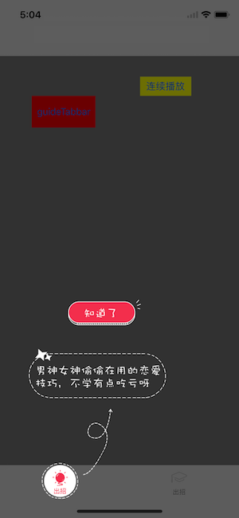

# GuideImageView
Object-C ，GuideImageView,新手引导

[简书 https://www.jianshu.com/p/b40f5decd085](https://www.jianshu.com/p/b40f5decd085)

support light on UITabBarItem

常用方法：
#####一、主要用于普通View

`- (void)addGuideWithMaskView:(UIView*)maskView imageName:(NSString*)imageName imageSize:(CGSize)imageSize maskImageRect:(CGRect)maskImageRect confirmRect:(CGRect)confirmRect clickBlock:(GuideImageViewClickBlock)clickBlock;`

这里解释下maskImageRect和confirmRect。

maskImageRect和confirmRect都是图片中的相对坐标系。

高亮部分为maskImageRect，上图中为(180, 0 ,110 ,40)

确认部分为confirmRect，上图为( 50 , 207 , 120 , 40)

demo中使用方法为

`[[[GuideImageView alloc] init] addGuideWithMaskView:view imageName:@"Group1" imageSize:CGSizeMake(289, 247) maskImageRect:CGRectMake(180, 0, 110, 40) confirmRect:CGRectMake(50, 207, 120, 40) clickBlock:clickBlock];`

点击maskImageRect和maskImageRect都会有clickBlock

并且confirmRect的位置会`[self removeFromSuperview]`移除视图

--------------

#####二、对于UITabBarItem，则根据下面方法

`- (void)addGuideWithTabBarItemIndex:(NSUInteger)index imageName:(NSString*)imageName imageSize:(CGSize)imageSize maskImageRect:(CGRect)maskImageRect confirmRect:(CGRect)confirmRect clickBlock:(GuideImageViewClickBlock)clickBlock;`
demo：
`[[[GuideImageView alloc] init] addGuideWithTabBarItemIndex:index imageName:@"Group4" imageSize:CGSizeMake(218, 313) maskImageRect:CGRectMake(20, 255, 60, 58) confirmRect:CGRectMake(60, 0, 120, 40) clickBlock:clickBlock]`

-----
